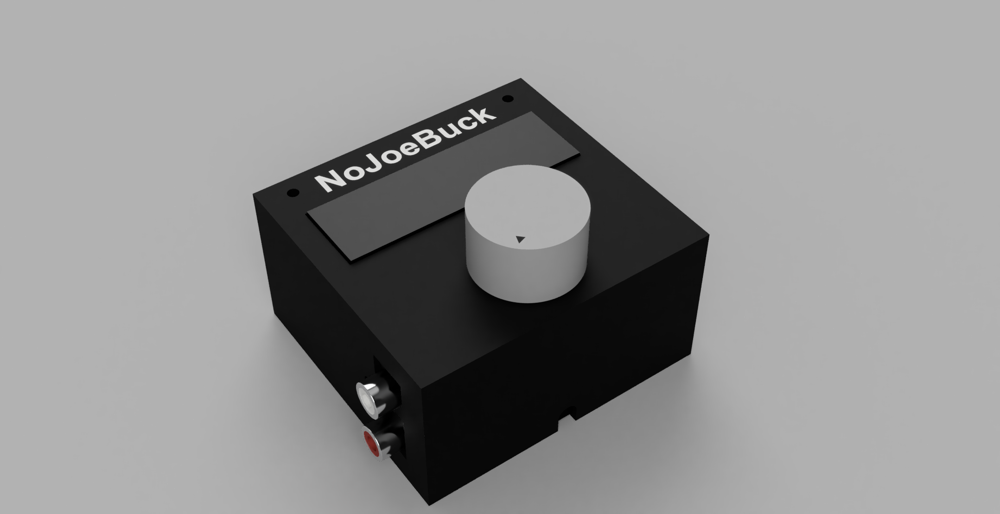

# nojoebuck

nojoebuck is an audio buffering program intended for use on Raspberry Pi
hardware.  It allows you to add delay to an audio source such as a radio
broadcast of a sporting event.  This makes it possible to sync the audio
from a radio broadcast to a streamed video of the same broadcast.

## Hardware



This can run on any Linux platform, but the Raspberry Pi Zero was the intended
platform.  Here are the basics:
  * Raspberry Pi Zero - Any Linux machine will work, but this is cheap and small
  * ALSA compatible capture and playback devices
    * Full size Raspberry Pis have playback interfaces but will need a capture device
    * Pi Zero has no audio interfaces, so I used the [Zero Soundcard](https://www.audioinjector.net/rpi-zero)
  * Optional hardware based UI
    * [Microdot PHAT](https://shop.pimoroni.com/products/microdot-phat?variant=25454635591)
    * [Rotary Encoder](https://www.adafruit.com/product/4991)
  * I've created a [case](hw/) that can be 3D printed for the above hardware configuration

## Setup

The easiest way to setup is to clone the github repo onto the machine, build and install:
  1. Install dependencies:  `sudo apt-get install build-essential git alsa-utils libasound2-dev python3-microdotphat python3-zmq python3-smbus2 libzmq3-dev libsystemd-dev`
  1. Clone the repository: `git clone https://github.com/cj8scrambler/nojoebuck.git`
  1. Build: `cd nojoebuck; make`
  1. Install as systemd services: `sudo make install`

Be sure that your sound capture and playback devices are running and configured in the mixer.  The Zero Soundcard has instructions [here](https://github.com/Audio-Injector/stereo-and-zero)

## Usage

nojoebuck is started as a systemd service.  Options can be configured in
`/etc/default/nojoebuck`.  The default values are listed there.
```
# systemd configuration values for nojoebuck audio delay service.
# Default values are listed below and commented out.
#
 
# Bit depth to capture at
#
#BITS="--bits 16"

# Sampling Rate
#
#RATE="--rate 48000"

# MB of Memory to reserve for buffer.  The determines the maximum delay
# possible.  With the default sampling depth/rate, the default of 32MB
# allows for up to 174.8 seconds of delay
#
#MEMORY="--memory 32"

# ALSA compatible playback interface name.  To see which interfaces are
#available on your system run: aplay -L
#
#PLAYBACK="--playback default"

# ALSA compatible capture interface name.  To see which interfaces are
#available on your system run: arecord -L
#
#CAPTURE="--capture default"

# If set to '-v', the output is more verbose
#
#VERBOSE=""

# If set to '-w', then wait for the specified playback and capture interfaces
# to become available.  This is useful when starting at boot with systemd.
#
#WAIT=""
WAIT="-w"
```

## Background

In the fall of 2016 the Cubs were making a strong run through the playoffs.
Since it was post-seaons, the games were no longer handled by the local
broadcasters who knew the team and provided insightful commentary.  Instead
the games were on national broadcast where the commentators had nothing useful
to say.

In the old days, you could simply turn off the TV sound and turn on the radio
broadcast to solve this.  However now with streaming video, the delay between
radio and video is too great.  This is where nojoebuck comes in.  Put it inline
with the radio audio source and you can tune the delay to get it to match the
streaming video source.

## Todo
  * Use a radio tuner (or maybe SDR) as the audio source
  * Verify mixer settings at runtime
  * Move from discrete stretching steps to continuous
